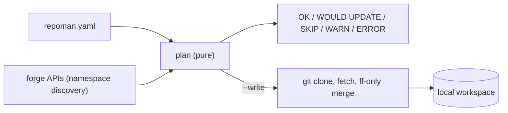

# repoman

Declarative multi-forge Git workspace sync. A preview-first CLI that plans and applies local
clones (forge-side mirrors are planned) from one YAML file. Runs on Linux, macOS and Windows.
Nothing changes on disk without `--write`; dirty trees and non-fast-forward states are skipped
with a reason, never overwritten.

## Getting started

Requires Python 3.11+ and Git.

```sh
pipx install repoman-cli      # or: pip install repoman-cli / uv tool install repoman-cli
repoman --version

repoman config init           # writes repoman.yaml; `repoman config path` shows where
# edit repoman.yaml: paths.workspace_root, remotes, namespaces
repoman config validate
repoman doctor                # tokens and API reachability
repoman local plan            # preview only
repoman local sync --write    # clone, fetch, fast-forward
```

The PyPI package is `repoman-cli`; the command is `repoman`. Tokens come from environment
variables or a `credentials.toml` next to `repoman.yaml`, never from the YAML itself.

## How it works



## Documentation

- [Getting started](https://github.com/dfabianus/repoman/blob/main/docs/getting-started.md): install, first config, tokens, first sync.
- [Design](https://github.com/dfabianus/repoman/blob/main/docs/design/repoman.md): architecture, schema, key decisions.
- [Examples](https://github.com/dfabianus/repoman/blob/main/docs/examples.md): sample commands and `include` / `exclude` recipes.
- [Changelog](https://github.com/dfabianus/repoman/blob/main/CHANGELOG.md): what changed per release.
- [Documentation site](https://dfabianus.github.io/repoman/): the same docs, rendered.

MIT licensed, see [LICENSE](https://github.com/dfabianus/repoman/blob/main/LICENSE).
